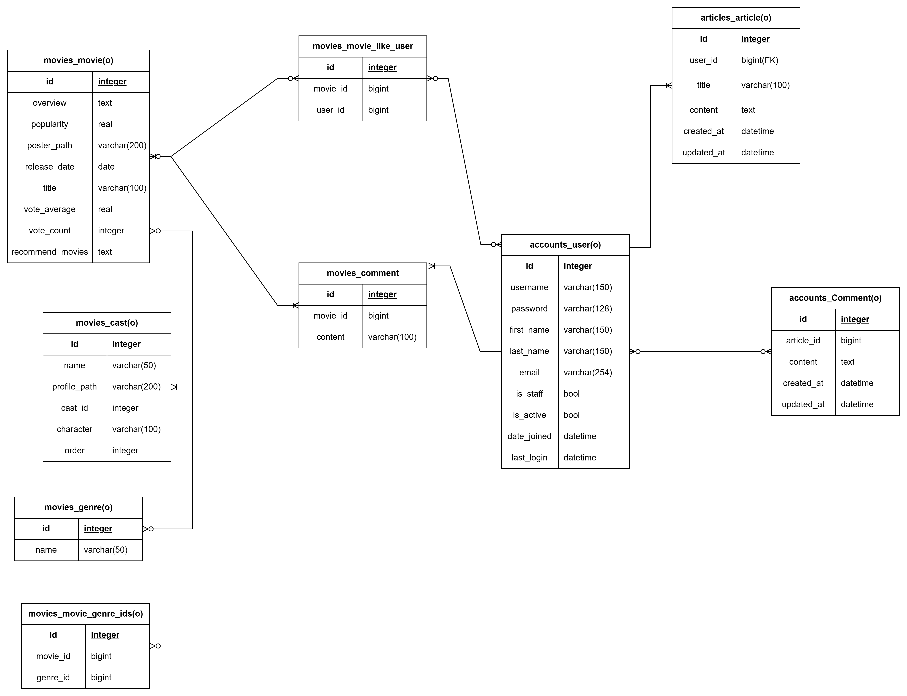

# Final-pjt

> 영화추천 알고리즘 기반 커뮤니티 서비스

1. 목표

- 영화데이터 기반 추천 서비스 구성
- 영화추천 알고리즘 구성
- 커뮤니티 서비스 구성
- 서비스 관리 및 유지보수

2. 팀 정보 및 업무 분담내역

- 팀 정보 : 김진주(팀장), 양지혜(팀원)
- 업무분담내역 : 시간별로 Driver와 Navigator를 교체하며 진행함.
  - Backend-Server(Django) : 양지혜
  - Frontend-Client(Vue) : 김진주

3. 데이터베이스 모델링(ERD)
   

4. 영화추천 알고리즘에 대한 기술적 설명

사용자가 클릭한 키워드와 일치하는지 data에 딕셔너리 형태로 저장하여 match되는지 판단 후 필터링하여 영화 출력

- 추천 키워드 정하기( 키워드는 # 으로 표기)

1. **#새로운 세계 (sf) : 상상력과 창의성 자극**

   SF (878) / 판타지 (14)

2. **#유난히 긴 밤 (music) : {유난히 긴 밤을 걷는} 당신을 위한**

   음악 (10402)

3. **#휴식 (drama)**

   드라마 (18)

4. **#사랑 (love) : 로맨틱한 분위기, 달달한 연애 감정이 필요할 때**

   로맨스 (10749)

5. **#위로 (family)** : **마음이 따뜻해지고 싶은 날**

   가족 (10751) / 애니메이션 (16)

6. **#하하하 (comedy) : 편하게 마음껏 웃고 싶을 때**

   코미디 (35)

7. **#몰입 (crime): 흥미진진한 추리**

   범죄 (80) / 스릴러 (53)

8. **#스펙터클 (adventure) : 새로운 자극이 필요할 때**

   액션 (28) / 모험 (12)

9. **#스트레스 해소 (horror) : 공포와 미스터리를 즐기고 싶은 당신에게**

   공포 (27) / 미스터리 (9648)

- 키워드를 클릭하면 새창에서 키워드와 함께 # 키워드와 { }

뒷부분(싶은 당신에게 추천하는 영화)이 나오고, 그 아래에 해당 장르 영화 list추천되게

```
  data() {
    return {
      movies: [],
      matching: {
        새로운_세계: [14, 878],
        유난히_긴_밤: [10402],
        사랑: [10749],
        위로: [16, 10751],
        하하하: [35],
        몰입: [53, 80],
        스펙터클: [12, 28],
        스트레스_해소: [27, 9648],
      },
      keywordImages: {
        새로운_세계: require("@/assets/sf.jpg"),
        유난히_긴_밤: require("@/assets/music.jpg"),
        사랑: require("@/assets/love.jpg"),
        위로: require("@/assets/family.jpg"),
        하하하: require("@/assets/comedy.jpg"),
        몰입: require("@/assets/crime.jpg"),
        스펙터클: require("@/assets/action.jpg"),
        스트레스_해소: require("@/assets/horror.jpg"),
      },
    };
  },

// 중복되는 영화를 제거하기 위하여 set사용
      filteredMovies() {
      const matchingGenreIds = this.matching[this.keyword];
      const filteredSet = new Set();
      this.movies.forEach((movie) => {
        movie.genre_ids.forEach((genre) => {
          if (matchingGenreIds.includes(genre.id)) {
            filteredSet.add(movie);
          }
        });
      });
      return Array.from(filteredSet);
    },
```

- 키워드 별 장르 필터링


<기존 코드>

: 필터링 할때 딕셔너리 형태로 순회하게 처리

⇒ 중복되는 영화가 발생


<수정한 코드>

: 각 영화를 `filteredSet`에 추가할 때, 중복된 영화는 자동으로 제거될 수 있도록 set을 사용함.

마지막에 `Array.from(filteredSet)`을 사용하여 `Set`을 `array`(배열)로 변환하여 반환해야 정상적으로 작동함.

⇒ 변환 이유 : Vue.js의 v-for 디렉티브는 배열을 기반으로 동작하므로Array.from() 메서드를 사용하여 다시 배열로 변환하고 호환성을 유지

5. 목표서비스 구현 및 실제 구현 정도 / 서비스 대표기능에 대한 설명

### URl 별 기능 구상

1. Main

   1. 검색 - 영화 검색
   2. 현재 상영작
   3. 인기 영화

   (추천 영화 끝에 전체 추천 영화를 볼 수 있는 버튼)

2. 회원가입 / 로그아웃
3. 회원정보 수정/ 회원탈퇴
4. 로그인
   - Profile / 게시판 / 감성 키워드 추천
5. 감성 키워드 추천 - 버튼 & 비동기 방식
6. Detail
   1. 찜하기
   2. 스틸컷
   3. 예고편 (유튜브 API)
7. Review 게시판
   - 로그인 X ( alert 창 → login 화면 router )
   - 로그인 O : 후기 작성 / 댓글 / 좋아요 / 팔로우
     - 별점 ( 별모양 material-icons )
8. Profile
   1. Wish List ( ← 찜하기 하트 하트모양 click )
   2. 팔로우, 작성한 Review 글 목록
9. 오류 페이지
10. 사이트 소개 페이지 ( Reelix 뜻, 서비스 소개 )

## 목표서비스 구현

1. 협업 툴 정하기
   1. 그라운드룰 : Canva
   2. 로고 : Canva
   3. ER다이어그램 : Lucid Chart
2. Vue 프로젝트 내에서 `<script>`를 통해 axios 를 실행하였는데,

Vuex와 Django 를 사용하는 방법으로 확장시켰을 때와 차이점을 체크해보고자 한다.

## 기존의 서비스 문제점 찾기

- 카테고리 분류 선택 어려움 → 현재상황별이나, 테마별 추천은 어떨까?
- 기존 서비스는 노래추천에 있어서는 분위기 별 추천이 있지만, 영화 추천서비스에는 영화에 정보 대한 키워드를 중심으로 추천하고 있어 본인의 컨디션에 맞는 추천영화를 편하게 고르기 어렵다.

## 구현한 기능

- 회원가입

400 46 error 발생하는 경우

: 비밀번호가 달랐을 때, 장고에서 제공해주는 allauth 모듈의 비밀번호 기본 양식에 어긋날 때

- 로그인

store / index.js 에서 router import 하고 router.push 사용해서 HomeView로 이동하게 만듦

- 로그아웃

로그인 한 유저만 Navbar에 로그아웃 버튼 보이게 하기

- DetailView 이름 변경 : ArticleDetailView
- 메인페이지에 배경이미지 넣기
- 버튼에 키워드 정리해서 생성
- 서치바 길이 조정 및 네비게이션 바의 메뉴토글버튼활성화 시 목록에 표출되도록 수정

- Youtube 예고편을 가지고 오기 위해서는 movie.json에 있는 movieID를 data에 담아 해당 디테일의 movie.id를 가져오기

- RecommendView 레이아웃 디자인 수정
- JSON 파일 수정 ( 필요한 Movie만 남겨놓기)
- Detail 페이지로 라우터 링크를 이용하여 넘어갈 수 있도록 구현

- Detail페이지에 movie.json의 movie데이터와 cast, crew 데이터 출력
- 배경화면 위에 키워드 넣기

## 해결한 문제들

로그인하면 회원가입 / 로그인 버튼 사라지게 v-if="!isLoggedIn”

로그인 & 회원가입 시
버튼에만 이벤트 지정해주니까 실행 안됨
=> 해결방법: 입력하는 input 태그에 @keyup.enter 적용

- 로그인하면 회원가입 / 로그인 버튼 사라지게 `v-if = " ! isLoggedIn ”`

- 로그인 & 회원가입 시 입력 후 Enter 누르면 제출되도록 설정

click 버튼에만 이벤트 지정해주니까 실행 안됨

입력하는 input 태그에 @keyup.enter 적용해서 해결

⇒ 입력하는 곳에서 Enter 키를 누르면, 로그인 또는 회원가입 이벤트가 실행됩니다.

이 방법을 사용하면, 버튼을 누르지 않아도 됨으로써 더욱 편리하게 이용할 수 있습니다.

마우스 호버시에 포스터가 확대 축소되도록 하였는데, 캐러셀이 적용되어있어 전체 포스터가 확대 축소 되는 문제가 있었음

⇒ 캐러셀을 자동슬라이드 하게 하지 않고 멈춰진 상태에서 작업해보기

- 게시판에 게시글이 1개 남았을 때 삭제해도 빈 리스트를 받아오지 못하는 에러

⇒ django 의 views 함수에서 get_list_or_404 로 받아온 방식을 objects_all 로 변경함

(get_list_or_404로 할 경우 빈 리스트일 때 404 반환하고, axios 의 .then() 요청을 실행하지 않아서 vue 파일의 created() 함수도 실행하지 않았던 것)

- 게시판 디테일 페이지에 수정시간을 넣었을 때 수정하고 나서 오류 발생

⇒ methods 밖에 함수가 정의되어 있었던 것

- ArticleDetail <에러>


ArticleDetail.vue 의 data() article : null 에서 아래 코드로 변경함

```
data() {
    return {
      article: {
      title: '',
      content: '',
    },
}
```

# 6. 기타(느낀점, 후기)

- 김진주 : vuex를 사용하면 함수를 한번에 정리하여 vue파일에서 불러올 때 간편하게 사용할 수 있는 점, modules를 사용하면 데이터를 가시적으로 정리할 수 있다는 것을 알게 되었고, 다음 프로젝트에는 뷰와 컴포넌트의 구조를 잘 설계하고, vuex와 router를 보기 쉽게 기능별로 정리하고 싶다.

<br>

- 양지혜 : 때로는 다지우고 새로 하는 것이 도움이 될 때가 있다.
  사소한 실수들을 하나하나 잡아가는 것이 더 시간이 오래 걸려서 다시 해보나까 세상에…name을 등록하지 않는 실수가 있기도 하고 참 안보이더라는…
  하고 싶은것이 많더라도 할 수 있는 것 먼저 실행해보면 이어지는 처리로 더 좋은 효율을 낼 수 있다.
  그리고 장고쪽에서 설계를 잘 해두면 데이터로딩 등의 속도가 현저히 차이가 나는데, 그런 부분을 더 공부해서 효율적인 코드를 짜고 싶다.
